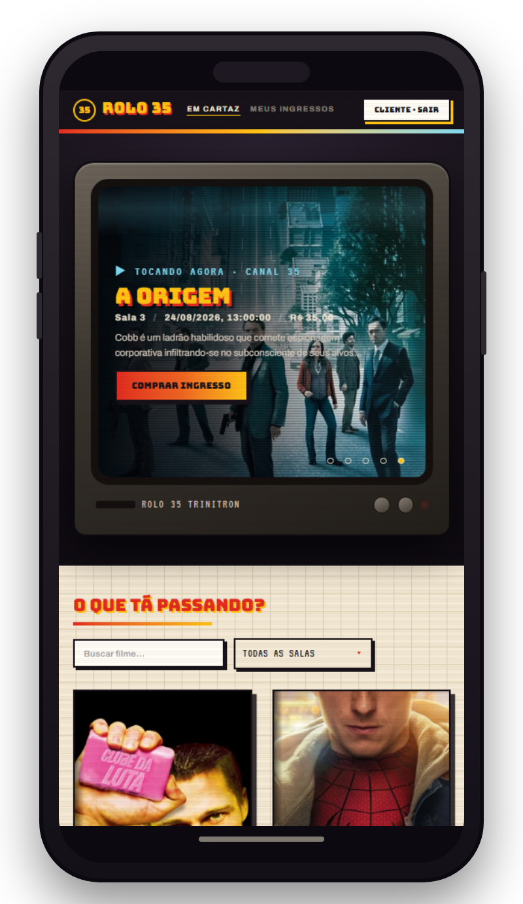

<p>
  
  
  
  
</p>

<p align="center">
  
  &nbsp;
  
</p>

**Rolo 35** é uma plataforma de ingressos de **um cinema**, com várias salas: o organizador publica
sessões a partir do catálogo do TMDb, o cliente escolhe o assento num mapa de sala, paga de forma
simulada e recebe um ingresso com código assinado e link público de compartilhamento, e a portaria
valida esse ingresso na entrada.

Resposta ao **Desafio Elite Dev** da Verzel. O enunciado deixou explícito que o que interessa não é
volume de tela, e sim como as decisões foram tomadas: este README existe pra isso. Cada regra de
negócio abaixo vem com o *por quê* e com o arquivo onde ela mora.

## Sumário

- [1. Fluxo ponta a ponta](#1-fluxo-ponta-a-ponta)
- [2. Estado da entrega](#2-estado-da-entrega)
- [3. Como rodar](#3-como-rodar)
  - [3.1 Pré-requisitos](#31-pré-requisitos)
  - [3.2 Subir a aplicação inteira](#32-subir-a-aplicação-inteira)
  - [3.3 Variáveis de ambiente](#33-variáveis-de-ambiente)
  - [3.4 Banco de dados, migrations e seed](#34-banco-de-dados-migrations-e-seed)
  - [3.5 Rodar os testes](#35-rodar-os-testes)
  - [3.6 Deploy e notas de operação](#36-deploy-e-notas-de-operação)
- [4. Dados de teste](#4-dados-de-teste)
- [5. Identidade visual](#5-identidade-visual)
- [6. Arquitetura](#6-arquitetura)
- [7. Modelo de dados](#7-modelo-de-dados)
- [8. Referência da API](#8-referência-da-api)
- [9. Regras de negócio aplicadas (e por quê)](#9-regras-de-negócio-aplicadas-e-por-quê)
  - [9.1 Autenticação e autorização](#91-autenticação-e-autorização)
  - [9.2 Catálogo de filmes (TMDb)](#92-catálogo-de-filmes-tmdb)
  - [9.3 Sessões](#93-sessões)
  - [9.4 Reserva de assentos](#94-reserva-de-assentos)
  - [9.5 Pagamento simulado](#95-pagamento-simulado)
  - [9.6 Ingresso, QR e link público](#96-ingresso-qr-e-link-público)
  - [9.7 Portaria](#97-portaria)
- [10. Concorrência: os invariantes que não podem quebrar](#10-concorrência-os-invariantes-que-não-podem-quebrar)
- [11. Segurança](#11-segurança)
- [12. Performance: índices e N+1](#12-performance-índices-e-n1)
- [13. Estratégia de testes](#13-estratégia-de-testes)
- [14. Principais decisões técnicas e trade-offs](#14-principais-decisões-técnicas-e-trade-offs)
- [15. Uso de IA](#15-uso-de-ia)
- [16. Dívida técnica e o que ficou de fora](#16-dívida-técnica-e-o-que-ficou-de-fora)
- [17. Mapa do repositório](#17-mapa-do-repositório)

---

## Aplicação publicada

| | |
|---|---|
| **Aplicação** | **https://rolo35-web.onrender.com** |
| API | https://rolo35-api.onrender.com |
| Documentação da API (Swagger UI) | https://rolo35-api.onrender.com/swagger-ui/index.html |

As credenciais dos quatro perfis semeados estão em [4. Dados de teste](#4-dados-de-teste): o banco
já sobe com organizador, dois clientes, portaria e nove sessões em cartaz, então dá pra percorrer o
fluxo inteiro sem cadastrar nada. Detalhes de infraestrutura e limites do plano contratado em
[3.6](#36-deploy-e-notas-de-operação).

---

## 1. Fluxo ponta a ponta


A escolha de domínio dentro do enunciado foi **cinema com mapa de assentos** (não pista por
quantidade): é o caminho onde os dois invariantes difíceis do desafio (não vender o mesmo lugar
duas vezes e não validar o mesmo ingresso duas vezes) ficam realmente expostos, em vez de virarem
um decremento de contador.

O TMDb entra só como **catálogo de metadado do filme** (título, pôster, sinopse, estreia). Sessão,
sala, mapa de assentos, preço e capacidade são modelo de domínio próprio: o TMDb não tem esse
conceito.

O escopo também ficou restrito a **um cinema único, com várias salas**, em vez de uma plataforma
multi-cinema com vários endereços. Foi corte deliberado, não limitação técnica: modelar múltiplos
cinemas abriria uma segunda dimensão de autorização (organizador × cinema × sala) sem agregar valor
real ao que o enunciado pede, só multiplicando a superfície de bugs de posse numa área que já exige
cuidado. Reduzir esse escopo foi o que sobrou de tempo pra investir de propósito na arquitetura e no
desenvolvimento do sistema em si, e não em generalizar pra um caso que ninguém pediu.

---

## 2. Estado da entrega

O desafio tem prazo de 7 dias e foi construído em fatias verticais testadas, épico por épico. Este
é o estado real do código nesta branch. **O fluxo fecha ponta a ponta pela interface: buscar sessão →
escolher assento → pagar → receber o ingresso com QR → compartilhar o link → validar na portaria.**

| Épico | Escopo | Estado |
|---|---|---|
| 1 | Fundação, schema, seed, login JWT com papel fixo, proxy TMDb, autocadastro de cliente | ✅ implementado |
| 2 | Criação/edição de sessão com bloqueio de conflito e trava pós-venda, listagem pública | ✅ implementado |
| 3 | Mapa de assentos público, reserva com hold temporário | ✅ implementado |
| 4 | Pagamento simulado (aprovação e recusa), emissão de ingresso com QR, "Meus ingressos", link público | ✅ implementado, ponta a ponta pela interface: checkout com cartão simulado, aprovação, recusa e expiração de hold; canhoto com QR escaneável; carteira do cliente e link público |
| 5 | Portaria: seleção da sessão do turno e validação do ingresso | ✅ implementado: seleção de sessão do turno, validação por câmera (QR) e digitação manual, quatro desfechos inequívocos (`VALIDO`/`INVALIDO`/`JA_UTILIZADO`/`EVENTO_ERRADO`) e não-validação-dupla provada sob concorrência real |

O que ficou de fora, com o motivo de cada item, está em
[16. Dívida técnica e o que ficou de fora](#16-dívida-técnica-e-o-que-ficou-de-fora).

---

## 3. Como rodar

### 3.1 Pré-requisitos

- **Docker** e **Docker Compose** (sobem Postgres, API e front; nada de Java nem de Node instalado
  na máquina é necessário pra rodar).
- Um **API Read Access Token do TMDb** (v4). Gere em
  <https://www.themoviedb.org/settings/api>: é o token longo (JWT), não a `api_key` v3 legada.
  Sem ele a API sobe normalmente, mas a busca de filmes responde `502 CATALOGO_INDISPONIVEL`: não
  existe segredo com fallback no código, por decisão de segurança. O resto do fluxo (sessão semeada,
  reserva, pagamento, ingresso) funciona sem TMDb.

### 3.2 Subir a aplicação inteira

```bash
git clone <url-do-repo> && cd rolo35
cp .env.example .env          # os valores padrão já servem pro dev local
# edite .env e cole seu TMDB_API_TOKEN
docker compose up -d --build
```

Um comando sobe os três serviços: Postgres, API e front.

Verificação:

```bash
curl -s localhost:8080/actuator/health     # {"status":"UP"}
curl -s localhost:8080/api/sessoes         # lista a sessão semeada, sem token
# e abra http://localhost:5173 no navegador
```

O primeiro `up` compila a API e o bundle do front dentro do Docker (multi-stage nos dois) e pode
levar alguns minutos. O Flyway aplica schema e seed automaticamente no boot da API: não há passo
manual de banco.

### 3.3 Variáveis de ambiente

`.env.example` está versionado; `.env` real nunca é commitado (está no `.gitignore`).

| Variável | Onde | Para que serve |
|---|---|---|
| `POSTGRES_DB` / `POSTGRES_USER` / `POSTGRES_PASSWORD` | raiz | Credenciais do Postgres do compose |
| `JWT_SECRET` | raiz | Assinatura do token de sessão do usuário. **Sem fallback no código** |
| `TICKET_HMAC_SECRET` | raiz | Assinatura do código do ingresso. Deliberadamente **distinto** do `JWT_SECRET`: protegem coisas diferentes (sessão de usuário × autenticidade do ingresso) |
| `TMDB_API_TOKEN` | raiz | Token v4 do TMDb, usado só pelo back-end |
| `CORS_ALLOWED_ORIGINS` | raiz | Allow-list de origens da API (default: `http://localhost:5173`) |
| `TZ` | raiz | Fuso da JVM e do Postgres. **Obrigatória**, veja o aviso abaixo |
| `PORTARIA_JANELA_ANTES_MINUTOS` / `PORTARIA_JANELA_DEPOIS_HORAS` | raiz | Janela em que a portaria pode ativar uma sessão como turno (defaults: `30` e `2`). O compose já sobe alargado: sem isso nenhuma sessão do seed é selecionável, veja abaixo. O blueprint do Render fixa o mesmo valor, pelo mesmo motivo ([3.6](#36-deploy-e-notas-de-operação)) |
| `VITE_API_URL` | raiz | URL da API consumida pela SPA. Lida em tempo de **build** (o Vite inlina no bundle), então mudá-la exige `docker compose up -d --build web`; restart não basta. Fica na raiz porque é de lá que o `docker-compose.yml` a lê como build arg; `web/.env` só vale pro `vite dev` |

> ⚠️ **`TZ` é obrigatória, inclusive no deploy.** `sessoes.data_hora` é wall-clock sem fuso: o
> organizador escolhe "20:00" e é isso que vai pro banco. API, banco e navegador precisam concordar
> sobre que "20:00" é esse. `Dockerfile` e `docker-compose.yml` já fixam
> `TZ=America/Sao_Paulo`; num serviço gerenciado, configure a mesma variável. Sem ela o container
> roda em UTC e rejeita como "no passado" qualquer horário nas próximas 3 horas.

### 3.4 Banco de dados, migrations e seed

- **PostgreSQL 16** (imagem `postgres:16-alpine`), exposto em `localhost:5432`, dados num volume
  nomeado (`rolo35-postgres-data`), que sobrevive a `docker compose down`.
- **Flyway** roda no boot da API, a partir de `api/src/main/resources/db/migration`:

| Migration | Conteúdo |
|---|---|
| `V1__schema.sql` | Schema completo: `usuarios`, `salas`, `assentos`, `sessoes`, `reservas`, `assento_sessao`, `ingressos` |
| `V2__seed.sql` | Dados de teste versionados (4 usuários, 3 salas, 1 sessão publicada) |
| `V3__indice_sessoes_sala_data_hora.sql` | Índice composto que serve a query de conflito de horário |
| `V4__indices_ingressos_por_cliente.sql` | Índices de `reservas.cliente_id` e `ingressos.reserva_id` para "Meus ingressos" |
| `V5__indice_assento_sessao_reserva.sql` | Índice de `assento_sessao.reserva_id` para retomar o checkout |
| `V6__turno_portaria.sql` | Tabela `turno_portaria` (sessão ativa por operador) |
| `V7__indice_ingressos_por_sessao.sql` | Índice de `ingressos.sessao_id` para o painel do turno |
| `V8__backstops_ingressos.sql` | FK composta de `ingressos` contra `assento_sessao` e `UNIQUE (reserva_id, assento_id)` |
| `V9__remove_indice_sessoes_sala_id.sql` | Remove índice redundante desde a `V3` |
| `V10__seed_mais_sessoes.sql` | Mais 5 sessões publicadas, com dois filmes em mais de um horário |
| `V11__codigo_curto_ingresso.sql` | Coluna `codigo_curto` do ingresso, única e indexada |
| `V12__horario_redondo_sessao_do_seed.sql` | Arredonda a sessão da `V2`, que nascia no minuto exato do boot |
| `V13__seed_mais_tres_sessoes.sql` | Mais 3 sessões publicadas, uma por sala, na segunda semana |
| `V14__reserva_cancelada.sql` | Novo status `CANCELADA` em `reservas.status`, para o hold abandonado quando o cliente reserva de novo na mesma sessão (ver [9.4](#94-reserva-de-assentos)) |

- `spring.jpa.hibernate.ddl-auto=validate`: o Hibernate **nunca** cria nem altera tabela. O schema
  é do Flyway; a aplicação só valida se o mapeamento casa.
- **Se a API não subir na `V8`**: o motivo é ela adicionar constraint a uma tabela que já tem
  linha, e um ingresso órfão (assento que não está mais no mapa daquela sessão) faz o Flyway abortar
  o boot. Cenário de volume de desenvolvimento antigo, nunca acontece em volume novo. Em ambiente de
  desenvolvimento o caminho curto é o `down -v` logo abaixo, que recomeça do seed.
- Zerar tudo e recomeçar do seed:

```bash
docker compose down -v && docker compose up -d --build
```

- Acesso direto ao banco:

```bash
docker exec -it rolo35-postgres psql -U rolo35 -d rolo35
```

### 3.5 Rodar os testes

```bash
cd api && ./mvnw test     # back-end (JUnit 5, Mockito, Testcontainers; precisa de Docker)
cd web && npm test        # front-end (Vitest + Testing Library)
```

Os testes de integração sobem um Postgres real via Testcontainers, com `withReuse(true)` para não
recriar o container em cada rodada.

### 3.6 Deploy e notas de operação

`render.yaml` na raiz é um **blueprint** que sobe os três serviços numa conta só (Static Site pro
front, Web Service (Docker) pra API e Postgres gerenciado), em *Blueprints → New Blueprint
Instance*, apontando pro repositório. Substituiu o arranjo anterior de API no Render + front na
Vercel: duas contas, dois deploys e duas origens pra manter em sincronia por CORS.

**A aplicação está no ar**: front em <https://rolo35-web.onrender.com>, API em
<https://rolo35-api.onrender.com>. O Docker Compose ([3.2](#32-subir-a-aplicação-inteira)) continua
sendo o caminho de execução local, e não depende de nada disso.

Dois valores o blueprint não tem como derivar e pede no apply (ou no dashboard, depois dele):

- `TMDB_API_TOKEN`: segredo, nunca versionado.
- `CORS_ALLOWED_ORIGINS` na API e `VITE_API_URL` no front: cada um precisa da URL do outro. São
  previsíveis (`https://<nome-do-serviço>.onrender.com`), mas o Render sufixa o nome quando ele já
  está em uso, então chutar no arquivo seria pior do que preencher com a URL real. `VITE_API_URL` é
  lida em tempo de build (o Vite inlina no bundle), então trocá-la exige redeploy do front.

Notas de operação:

- **A API roda no plano `starter`, não no free, e a diferença é de CPU.** Medido num container com
  as restrições do free (0.1 vCPU, 512 MB), o Spring Boot leva **179s** pra subir: o trabalho de
  startup é quase todo CPU-bound e single-thread (carga de classes em modo interpretado, metamodel
  do Hibernate, springdoc varrendo os controllers), então a 10% de um core cada etapa custa dezenas
  de vezes o normal. Somado ao fato de o serviço free dormir após 15 min sem tráfego, a primeira
  requisição depois de qualquer pausa estourava o timeout de 90s do cliente HTTP do front. O
  `starter` dá 0.5 vCPU (~36s de boot) e **não dorme**, então o cold start deixa de existir em vez
  de só encurtar. A RAM é a mesma (512 MB) e já era folgada: o teste estabilizou em 318 MB.
- **O front não dorme em nenhum plano**: Static Site é CDN, então a aplicação abre na hora.
- O Postgres free expira depois de um período; o prazo aparece no dashboard ao criar o banco.
- `TZ=America/Sao_Paulo` já vai fixada no blueprint. Ela não é cosmética: além do wall-clock de
  `sessoes.data_hora`, o `now()` que a listagem pública e o guard de reserva comparam vem do fuso da
  sessão JDBC, que o driver deriva do fuso da JVM (ver [3.3](#33-variáveis-de-ambiente)).
- **`PORTARIA_JANELA_ANTES_MINUTOS=20160` também vai fixada**, pelo mesmo motivo que o compose a
  alarga. Todo o seed nasce entre 7 e 13 dias à frente, então com o default de `-30min/+2h` (a regra
  e o porquê dela estão em [9.7](#97-portaria)) **nenhuma sessão semeada seria selecionável e o fluxo
  da portaria ficaria inacessível na aplicação publicada**. Não é hipótese: o primeiro deploy subiu
  sem a variável e respondia `SESSAO_FORA_DA_JANELA_DO_TURNO` pra qualquer sessão do seed. A regra
  continua no código e continua testada nos defaults pela suíte; o que muda é o valor de operação
  deste ambiente, que é uma demonstração, e regra que ninguém consegue exercitar não demonstra nada.

---

## 4. Dados de teste

4 perfis semeados por `V2__seed.sql` (hash BCrypt no banco; a senha em claro abaixo existe só
pra avaliação):

| Papel | E-mail | Senha |
|---|---|---|
| Organizador | `organizador@rolo35.com.br` | `organizador123` |
| Cliente | `cliente1@rolo35.com.br` | `cliente123` |
| Cliente | `cliente2@rolo35.com.br` | `cliente123` |
| Portaria | `portaria@rolo35.com.br` | `portaria123` |

Também vêm semeadas **3 salas** de tamanhos diferentes (Sala 1, 8×10 = 80 assentos; Sala 2,
5×6 = 30; Sala 3, 10×14 = 140) e **9 sessões publicadas**, espalhadas pelas três salas nas
próximas duas semanas, com todos os assentos livres:

| Filme | Sessões | Onde |
|---|---|---|
| *Clube da Luta* (1999) | 2 | Sala 1 e Sala 3 |
| *Matrix* (1999) | 2 | Sala 1 e Sala 2 |
| *Cidade de Deus* (2002) | 1 | Sala 2 |
| *A Origem* (2010) | 1 | Sala 3 |
| *De Volta para o Futuro* (1985) | 1 | Sala 1 |
| *Obsessão* (2026) | 1 | Sala 2 |
| *Psicopata Americano* (2000) | 1 | Sala 3 |

Pôster, sinopse e data de estreia são reais, buscados uma vez no TMDb e congelados no SQL: não se
atualizam se o catálogo mudar depois. Dois filmes em mais de um horário existem pra que a tela de
filme mostre o que ela faz: lista de horários, "a partir de" quando os preços divergem e o resumo
de salas. Os horários deixam folga de sobra dentro de cada sala, então ainda dá pra criar sessão
durante a avaliação sem esbarrar em conflito, e `SeedSessoesRepositoryTest` garante que o próprio
seed respeita o buffer de 4h que a aplicação aplica.

---

## 5. Identidade visual

O enunciado pediu explicitamente pra fugir da interface genérica que sai pronta de qualquer prompt.
A direção escolhida é **cinema de rua dos anos 80/90**: TV de tubo, fita VHS, cartaz de locadora. O
nome vem do rolo de película 35mm.

**Como o nome e o tema chegaram aqui**

Como o enunciado pedia para fugir do AI Slop, decidi sair da minha zona de conforto e investir meu
tempo no design para criar algo único. Todo o processo de criação deu início através da busca por um
nome: eu queria algo que carregasse uma identidade e pudesse servir de inspiração para um tema
futuro. Depois de várias sugestões de IA e pesquisas por referências, me vi em um impasse entre dois
nomes com identidades distintas e únicas: **Kineo** e **Rolo 35**.

O Kineo vinha da palavra de origem grega *kinesis* (que em português é "movimento"), a própria raiz
da palavra "cinema". Logo imaginei o design se inspirando nas construções e monumentos clássicos da
Grécia Antiga: grandes pilares, moldura customizada e tematizada na arquitetura da época, e um menu
de navegação que lembrava a fachada de um monumento, com o formato do telhado e pilares nas
extremidades. Essa ideia foi abortada por dois motivos: falta de tempo para polir todo esse design
(ainda mais considerando minha pouca experiência na área) e por gosto próprio, já que achei que a
estética combinava mais com teatro do que com cinema.

Sendo assim, decidi ficar com o **Rolo 35**, que aborda uma temática da qual gosto muito: algo mais
retrô, inspirado nos clássicos cinemas de rua americanos dos anos 80/90. No início, tentei passar
para a IA a ideia de como eu queria, mas caía justamente no clássico design minimalista padrão que
ela costuma entregar.

Depois dessa frustração, fui atrás de inspirações no Dribbble e encontrei esta referência:
["Retromax, Retro Movie Theater Website"](https://dribbble.com/shots/24299883-Retromax-Retro-Movie-Theater-Website).
Com base nela, decidi juntar também uma temática mais arcade, com glitches e pontas retas para um
destaque visual único, contrastando com o fundo xadrez do layout, criando um design que foge
totalmente do minimalismo padrão que a IA costuma empurrar.

Com referências e uma ideia clara em mente, comecei a projetar pelo **Claude Design** até chegar ao
resultado esperado, o protótipo `Rolo 35.dc.html`, de onde saíram as escolhas de paleta e tipografia
que viraram tokens antes da primeira tela existir. Sem muitos conhecimentos formais de UX Design, o
critério usado foi basicamente gosto próprio e bom senso kkkkk.

Desse protótipo saíram os tokens concretos usados no projeto: paleta, tipografia e as decisões de
tema abaixo.

| Token | Valor | Uso |
|---|---|---|
| Tinta | `#171219` / `#0C0910` | Fundo escuro roxo-preto, header, rodapé |
| Papel | `#F4E9D4` / `#FFFDF6` | Fundo das telas de conteúdo e dos cartões |
| Chama | `#E32B21` → `#F26522` → `#FFC414` | Gradiente de destaque (marca, CTA, estados quentes) |
| Ciano | `#7ED9F2` | Contraste e **foco de teclado** |
| Marinho | `#123A5C` | Texto de status sobre fundo claro |

Tipografia: **Bungee** (display), **Archivo** (corpo/UI) e **VT323** (monospace retrô, para códigos,
contadores, texto de terminal), servidas localmente via `@fontsource` em vez de CDN.

A paleta segue a mesma pista do nome: o gradiente chama (vermelho → laranja → amarelo) é a cor de
cartaz de sessão dupla e de letreiro de marquise; o roxo-preto do fundo é a sala escura; o ciano é o
fósforo do tubo, e por isso é ele que marca foco de teclado.

Decisões de tema que não são enfeite:

- **Textura faz parte do sistema**, não é polimento opcional: scanline fixa sobre a viewport, grão e
  *flicker* de tubo. É o que separa "tema aplicado" de "cor trocada".
- **Só a portaria é escura, e isso é sobre onde ela é usada.** As telas de público rodam sobre papel
  claro; as duas telas de portaria usam `PageShell variant="terminal"`, com fundo `ink-950` e sem a
  grade de papel. A validação acontece na entrada da sala, com a luz já baixa e o filme começando:
  jogar uma tela clara na cara de quem confere ingresso ali machuca o olho e ainda estoura a visão
  adaptada ao escuro. Fundo escuro também deixa o veredito (`VALIDO`, `JA_UTILIZADO`) ser a coisa
  mais brilhante em cena, que é a única informação que importa naquele momento.
- **Cartões em "painel de quadrinho"**: borda preta de 3px com sombra deslocada, sem blur, decisão
  estética que também dá contraste alto de graça.
- **Cor de acento por filme derivada de hash do `tmdbId`**, não de um campo no banco: cada filme
  ganha identidade consistente entre telas sem inventar dado de domínio.
- O foco de teclado usa o ciano em `outline` de 3px: o tema não come a acessibilidade.

Uso de IA no design está declarado em detalhe em [15. Uso de IA](#15-uso-de-ia).

A prévia no topo deste README é o tema montado, nos dois extremos de largura: no desktop o destaque
tem coluna de texto à esquerda do cartaz; no mobile o texto passa a se sobrepor à imagem e a
listagem encolhe para duas colunas, mas o tubo continua sendo a moldura do destaque nos dois,
porque é ele que fecha a metáfora.

---

## 6. Arquitetura

```
rolo35/
├── api/                  Spring Boot 4.1 · Java 21 · JPA · Flyway · Spring Security
├── web/                  Vite + React 19 + TypeScript estrito + Tailwind 4
├── docker-compose.yml    Postgres + API + front (execução local, um comando)
├── render.yaml           Blueprint do deploy: os mesmos três serviços no Render
├── docs/                 decisions.md · regras-de-negocio.md · assets/
└── _bmad-output/         Artefatos de processo: brief, PRD, arquitetura, épicos, stories
```

**Empacotamento por domínio, não por camada técnica.** No back-end, `auth`, `sessoes`, `reservas`,
`pagamentos` e `ingressos` são pacotes de primeiro nível, cada um com seu `controller/`, `service/`,
`repository/`, `dto/` e exceções. A direção de dependência é fixa (`sessoes` é upstream de todos;
nada aponta de volta). Quando `ReservaService` precisou da mesma regra de TTL que `SessaoService`
usa, a regra foi **duplicada de propósito** em vez de criar uma dependência invertida, e o comentário
no código explica por quê.

**Camadas:** controller só orquestra (recebe DTO, chama service, devolve DTO); regra de negócio vive
no service; SQL/JPQL no repository. Nenhum controller decide regra.

**DTO explícito por endpoint.** Nenhuma resposta serializa entidade JPA. Isso não é preferência de
estilo: é o que garante que `senha_hash` não escapa e que o mapa de assentos não vaza *quem*
reservou.

**Envelope de erro único.** Todo erro sai como `{ "codigo": "...", "mensagem": "..." }` via
`GlobalExceptionHandler`, com um `@ExceptionHandler` por exceção de domínio. O front trata erro por
código, nunca por texto. A tabela de códigos está em [8. Referência da API](#8-referência-da-api).

**No front**, `web/src/api/` é a única camada que fala HTTP; componente nenhum faz `fetch`. O token
JWT fica em `localStorage` (SPA em domínio diferente da API: cookie exigiria CORS com credencial e
CSRF, complexidade que o escopo não paga).

Documento completo:
`_bmad-output/planning-artifacts/architecture/architecture-rolo35-2026-08-10/ARCHITECTURE-SPINE.md`.

---

## 7. Modelo de dados

![Modelo de dados com as 8 tabelas e suas chaves: usuarios (papel restrito por CHECK a três papéis)
aponta para sessoes como organizador, para reservas como cliente e para turno_portaria como operador;
salas tem assentos e abriga sessoes; assento_sessao tem chave primária composta de sessao_id e
assento_id, status livre/reservado/vendido (mais MEU_HOLD, calculado só na leitura pro dono do hold),
reserva_id nulo e expires_at do hold; reservas carrega status (ativa/confirmada/recusada/cancelada) e
expires_at de 10 minutos; ingressos tem id UUID não sequencial, codigo_curto único e status
válido/utilizado; turno_portaria guarda a sessão ativa de cada operador de
portaria](docs/assets/modelo-de-dados.svg)

Oito tabelas, todas em português (`usuarios`, `salas`, `assentos`, `sessoes`, `reservas`,
`assento_sessao`, `ingressos`, `turno_portaria`); código em inglês. O schema inteiro subiu numa
migration só, porque as FKs cruzam domínios e fatiar por épico geraria `ALTER` a cada semana sem
ganho nenhum. `turno_portaria` é a exceção: nasceu numa migration própria (`V6`), depois do schema
inicial, porque o épico da portaria só existia como conceito quando ela foi desenhada.

Duas escolhas de modelagem que carregam o peso do sistema:

**`assento_sessao` como linha pré-criada.** Quando a sessão é criada, uma linha por assento da sala
já nasce com status `LIVRE`. A PK composta `(sessao_id, assento_id)` garante que um assento existe
**uma única vez** por sessão, então "reservar" é `UPDATE` numa linha que já existe, com lock, em vez
de `INSERT` disputado. O invariante "não vender o mesmo lugar duas vezes" cai no lugar mais barato
possível: uma linha travável.

**`ingressos.id` é UUID gerado pela aplicação**, não `BIGSERIAL`. Ingresso é o único identificador
que circula pra fora do sistema (QR, link público); sequência incremental convidaria enumeração.

Constraints que expressam domínio, não só validação de aplicação:

- `CHECK` em `usuarios.papel`, `reservas.status`, `assento_sessao.status`, `ingressos.status`: não
  existe papel ou status livre, nem via `psql`.
- `UNIQUE (email)` em `usuarios`; `UNIQUE (sala_id, fileira, numero)` em `assentos`;
  `UNIQUE (reserva_id, assento_id)` em `ingressos`: uma reserva não emite dois canhotos pra mesma
  poltrona.
- FKs coerentes em todas as relações acima, incluindo a composta de `ingressos (sessao_id,
  assento_id)` contra `assento_sessao`: ingresso aponta pra uma linha real do mapa daquela sessão,
  não pra um par (sessão, assento) que só existe separado.

O que **falta** no schema está declarado em [16](#16-dívida-técnica-e-o-que-ficou-de-fora).

---

## 8. Referência da API

Toda a superfície pública e autenticada do back-end, com o papel que cada rota exige. Base local:
`http://localhost:8080`. Autenticação via `Authorization: Bearer <token>`.

| Método | Rota | Papel | O que faz |
|---|---|---|---|
| `POST` | `/api/auth/login` | público | Autentica e devolve token + papel |
| `POST` | `/api/auth/cadastro` | público | Cria conta com o papel escolhido e devolve token + papel. Teto de 5 por hora por endereço de origem (`429 LIMITE_DE_CADASTRO_EXCEDIDO`), ajustável por `CADASTRO_LIMITE_TENTATIVAS` e `CADASTRO_LIMITE_JANELA_MINUTOS` |
| `GET` | `/api/filmes/buscar?query=` | autenticado | Busca filmes no TMDb via proxy |
| `GET` | `/api/salas` | **público** | Salas disponíveis, usadas na criação de sessão e no filtro da vitrine |
| `POST` | `/api/sessoes` | `ORGANIZADOR` | Cria sessão (valida data futura e conflito de sala) |
| `GET` | `/api/sessoes` | **público** | Sessões futuras publicadas, com marcação de esgotada. Paginado e filtrável: `?q=` (título), `tmdbId`, `salaId`, `pagina` (0), `tamanho` (12) |
| `GET` | `/api/sessoes/gestao` | `ORGANIZADOR` | Agenda de gestão do cinema (todas as sessões), com `pagina` e `tamanho` |
| `GET` | `/api/sessoes/ocupacao?salaId=` | `ORGANIZADOR` | Janelas bloqueadas da sala, com buffer aplicado (só o intervalo, sem título nem autor) |
| `GET` | `/api/sessoes/{id}` | `ORGANIZADOR` | Sessão para gestão |
| `PUT` | `/api/sessoes/{id}` | `ORGANIZADOR` | Edita sessão (bloqueado após venda) |
| `GET` | `/api/sessoes/{id}/mapa-assentos` | **público** | Mapa com status por assento, sem identidade |
| `POST` | `/api/reservas` | `CLIENTE` | Cria hold de 1–6 assentos por 10 min |
| `GET` | `/api/reservas/{id}` | `CLIENTE` | Reserva para reconstruir o checkout (só do dono; única leitura de reserva sem lock) |
| `POST` | `/api/pagamentos/confirmar` | `CLIENTE` | Pagamento simulado (`APROVADO`/`RECUSADO`) |
| `GET` | `/api/ingressos/minhas` | `CLIENTE` | Ingressos do cliente autenticado |
| `GET` | `/api/ingressos/{codigo}` | **público** | Leitura pública do ingresso (não consome) |
| `POST` | `/api/portaria/turno` | `PORTARIA` | Seleciona a sessão do turno (janela de -30min/+2h em volta do horário) |
| `GET` | `/api/portaria/turno` | `PORTARIA` | Sessão do turno atualmente selecionada |
| `GET` | `/api/portaria/turno/painel` | `PORTARIA` | Painel da sessão do turno: contagem de ingressos validados/pendentes |
| `POST` | `/api/portaria/validacoes` | `PORTARIA` | Valida um ingresso (QR ou código curto); devolve `VALIDO`/`INVALIDO`/`JA_UTILIZADO`/`EVENTO_ERRADO` |
| `GET` | `/actuator/health` | **público** | Health check |
| `GET` | `/swagger-ui.html`, `/v3/api-docs` | **público** | Documentação da API (springdoc) |

Documentação interativa em **`/swagger-ui.html`** (JSON em `/v3/api-docs`), pública como a
documentação que é. Use *Authorize* com o `token` de `POST /api/auth/login` pra exercitar as rotas
autenticadas direto de lá.

Envelope de erro: `{ "codigo": "SESSAO_CONFLITANTE", "mensagem": "..." }`. A tabela abaixo é a
fonte única desses códigos; eles não são repetidos endpoint a endpoint no OpenAPI.

| Código | HTTP | Quando |
|---|---|---|
| `CREDENCIAIS_INVALIDAS` | 401 | E-mail ou senha inválidos |
| `NAO_AUTENTICADO` | 401 | Token ausente/inválido, ou usuário do token não existe mais |
| `NAO_AUTORIZADO` | 403 | Papel errado, ou reserva/ingresso de outro cliente |
| `PARAMETRO_INVALIDO` / `CORPO_INVALIDO` | 400 | Validação de entrada |
| `DATA_HORA_NO_PASSADO` | 400 | Sessão no passado |
| `DATA_ESTREIA_INVALIDA` | 400 | Data de estreia fora do formato `AAAA-MM-DD` |
| `SESSAO_NAO_ENCONTRADA` / `SALA_NAO_ENCONTRADA` / `INGRESSO_NAO_ENCONTRADO` | 404 | Recurso inexistente (ou assinatura inválida, no caso do ingresso) |
| `METODO_NAO_SUPORTADO` | 405 | Método HTTP não existe pra este recurso |
| `EMAIL_JA_CADASTRADO` | 409 | Cadastro com e-mail que já existe |
| `SESSAO_CONFLITANTE` | 409 | Outra sessão na mesma sala dentro do buffer de 4h |
| `SESSAO_JA_COMECOU` | 409 | Reserva ou pagamento de sessão cujo horário já passou |
| `SESSAO_COM_INGRESSO_CONFIRMADO` | 409 | Edição após venda |
| `SESSAO_COM_HOLD_ATIVO` | 409 | Troca de sala com hold ativo |
| `SALA_SEM_ASSENTOS` | 409 | Sala sem mapa de assentos |
| `ASSENTO_INDISPONIVEL` | 409 | Assento já reservado ou vendido |
| `ASSENTO_EM_DISPUTA` / `RESERVA_EM_DISPUTA` / `INGRESSO_EM_DISPUTA` | 409 | `lock_timeout` estourou; pode tentar de novo |
| `RESERVA_EXPIRADA` | 409 | Hold de 10 min vencido |
| `SESSAO_ATIVA_NAO_SELECIONADA` | 409 | Portaria tentou validar sem selecionar a sessão do turno |
| `SESSAO_FORA_DA_JANELA_DO_TURNO` | 409 | Sessão fora da janela `-30min/+2h` pra virar sessão do turno |
| `CONFLITO_DE_DADOS` | 409 | Rede de proteção dos backstops de banco da `V8` (FK composta e `UNIQUE` de `ingressos`); não deveria disparar em uso normal |
| `LIMITE_DE_CADASTRO_EXCEDIDO` | 429 | Teto de cadastro por endereço de origem excedido |
| `MIDIA_NAO_SUPORTADA` | 415 | `Content-Type` diferente de `application/json` |
| `CATALOGO_INDISPONIVEL` | 502 | TMDb fora do ar ou lento |
| `SALA_OCUPADA` | 503 | Lock da sala não obtido na criação de sessão |
| `ERRO_INTERNO` | 500 | Erro não tratado (logado no servidor, sem detalhe na resposta) |

---

## 9. Regras de negócio aplicadas (e por quê)

Esta seção é o núcleo do README: cada regra abaixo está em código, com o arquivo onde mora e o
motivo de existir. O levantamento vivo, com número de linha, fica em
[`docs/regras-de-negocio.md`](docs/regras-de-negocio.md).

### 9.1 Autenticação e autorização

| Regra | Por quê |
|---|---|
| Três papéis fixos por conta (`ORGANIZADOR`, `CLIENTE`, `PORTARIA`), garantidos por `CHECK` no banco | Papel é dado de domínio, não string livre; o `CHECK` impede papel inventado mesmo por escrita direta no banco |
| JWT assinado (HMAC) carregando `sub` e `papel`, com expiração de 8h | Stateless: a API não guarda sessão, então reinício de container ou segunda instância não derrubam ninguém logado |
| **Papel checado por `@PreAuthorize` no método do controller**, não por matcher de path | Uma rota nova sem anotação simplesmente não passa. Com autorização por prefixo de path, esquecer um matcher significa herdar permissão por acidente: o modo de falha é invertido, e isso importa mais que a economia de anotações |
| Superfície pública é **allow-list explícita**: `POST /api/auth/login`, `POST /api/auth/cadastro`, `GET /actuator/health`, `GET /api/salas`, `GET /api/sessoes`, `GET /api/sessoes/{id}/mapa-assentos`, `GET /api/ingressos/{codigo}` | Liberar `/api/sessoes/**` de uma vez vazaria `GET /api/sessoes/{id}` (gestão) e `/api/sessoes/gestao`. O matcher do mapa é por path exato justamente por isso. `GET /api/salas` é público porque é a rota que monta o filtro de sala da vitrine: sem ela, o visitante deslogado veria o seletor abrir vazio. Nada vaza: `SalaResumoDto` só traz id, nome e capacidade, e o nome da sala já aparece em cada card da listagem pública |
| `POST /api/auth/cadastro` é a **única rota pública que escreve**, e tem teto por endereço de origem | As outras rotas públicas são de leitura, onde abusar custa banda. Esta cria conta com o papel que o corpo pedir, inclusive `PORTARIA`: abusar custa conta privilegiada. O teto é atrito contra mineração casual, não fronteira de segurança: quem tem muitos endereços passa, e a contagem vive na memória de um processo só |
| Login com e-mail inexistente roda BCrypt contra um hash dummy antes de recusar | Sem isso, o tempo de resposta diferencia "e-mail não existe" de "senha errada": enumeração de contas por *timing* |
| E-mail é normalizado no service (`trim` + `toLowerCase(Locale.ROOT)`) antes do lookup | `=` no Postgres é case-sensitive: sem isso, o teclado do celular que capitaliza a primeira letra derruba o login com "credencial inválida". `Locale.ROOT` porque em turco `"I".toLowerCase()` vira `ı` e quebraria e-mail com I maiúsculo. No service, não no front, porque a rota atende qualquer cliente HTTP |
| Todas as demais rotas exigem autenticação (`anyRequest().authenticated()`) | Default seguro: o que não foi liberado explicitamente está fechado |

### 9.2 Catálogo de filmes (TMDb)

| Regra | Por quê |
|---|---|
| Toda chamada ao TMDb passa pelo back-end (`GET /api/filmes/buscar`) | A chave nunca entra no bundle do client. Também dá um ponto único pra timeout, tratamento de erro e (no futuro) cache |
| Busca exige `query` não vazio | Evita queimar chamada externa por request vazio |
| Indisponibilidade do TMDb virou exceção de domínio própria (`502 CATALOGO_INDISPONIVEL`) | O front trata "catálogo fora do ar" como estado de tela, e não recebe erro cru de terceiro |
| Sem tabela `filmes` própria: a sessão guarda um **snapshot** de título/pôster/sinopse/estreia | O TMDb é a fonte da verdade do metadado, mas o ingresso vendido não pode mudar de nome porque alguém editou o filme lá. Snapshot é o único jeito de o ingresso continuar verdadeiro |

### 9.3 Sessões

| Regra | Por quê |
|---|---|
| **Capacidade vem do mapa de assentos real da sala**, não de `linhas × colunas` | As duas fontes podem divergir; vender ingresso baseado no retângulo declarado é vender assento que não existe |
| Sala sem assento cadastrado não pode virar sessão (`409 SALA_SEM_ASSENTOS`) | Sessão sem mapa é sessão que não pode ser reservada: falha cedo, não na primeira compra |
| Data/hora no passado é rejeitada, na criação e na edição | Regra óbvia de domínio; virou teste porque o bug de fuso a fazia disparar em horário válido |
| **Conflito de horário na sala com buffer de 4h**, checado nos dois sentidos | Sessão de cinema ocupa a sala por um tempo, e o domínio não tem coluna de duração. Um buffer fixo de 4h aproxima "filme + limpeza + intervalo" sem inventar campo. O intervalo é aberto: exatamente 4h depois **não** conflita, e há teste na fronteira |
| **Sessão é recurso do cinema, não do organizador que a criou**: qualquer `ORGANIZADOR` autenticado vê e edita qualquer sessão | O enunciado especifica um organizador seedado, sem isolamento entre contas. `sessoes.organizador_id` continua registrando a autoria e volta na resposta da edição, mas não restringe mais quem edita: a equipe é compartilhada, como numa bilheteria de verdade |
| Sessão com ≥1 ingresso confirmado **trava todos os campos**, sem exceção | Preço, horário e sala são o contrato de quem já comprou. Permitir editar "só o pôster" abre a discussão de qual campo é inofensivo; a trava total não abre |
| Trocar de sala numa edição reconstrói o mapa de assentos do zero | Só é seguro porque o passo anterior já provou que não há ingresso confirmado: nenhum estado de venda real se perde |
| Listagem pública mostra só sessões futuras, e **sessão esgotada continua aparecendo**, marcada | Esgotado é informação, não ausência: sumir da lista faz o usuário achar que a sessão não existe |
| Sem coluna `publicada`/rascunho | Publicar viraria um segundo estado a manter e testar por um ganho que o desafio não pede. Sessão criada já é sessão publicada |

### 9.4 Reserva de assentos

| Regra | Por quê |
|---|---|
| Cliente seleciona de **1 a 6 assentos**, sem duplicados | Limite de compra é regra comum de bilheteria e, de graça, limita o tamanho do lock e do lote de ingressos |
| **A seleção já é o hold**: os assentos entram em `RESERVADO` com `expires_at` de 10 min | Sem hold, dois clientes preenchem o cartão pro mesmo assento e um perde depois de pagar. O hold move o conflito pro clique, onde ele é barato |
| Reserva de múltiplos assentos é **atômica** | Hold parcial ("2 dos 3 assentos") é um estado que o usuário não pediu e a tela não sabe representar |
| **O hold expira por leitura (TTL lazy), sem job em background** | Um `RESERVADO` com `expires_at` vencido é reportado como `LIVRE` no mapa e pode ser reivindicado pelo próximo `UPDATE`. Um scheduler para isso precisaria de coordenação em múltiplas instâncias e ainda tem janela de atraso; o cálculo on-read não tem nem um nem outro |
| Assento indisponível responde `409 ASSENTO_INDISPONIVEL` e o cliente **permanece no mapa** | Perder a sessão e voltar pro começo por causa de um assento tomado é o pior momento pra desorientar o usuário |
| Timeout de lock virou exceção própria (`409 ASSENTO_EM_DISPUTA`), separada de "indisponível" | São coisas diferentes: uma é uma negativa concluída, a outra é incerteza por contenção; nesta o cliente pode tentar de novo com os mesmos assentos e conseguir |
| A validação de forma roda **antes** de qualquer lock | A transação que segura linhas de assento tem que ser a mais curta possível; rejeitar payload inválido depois do lock é segurar o recurso por nada |
| `GET /api/reservas/{id}` devolve tudo que o checkout precisa e é a **única leitura de reserva sem lock** | A tela tem que se reconstruir depois de um F5 sem depender de nada no navegador. Ler para exibir não disputa recurso com ninguém: travar a linha aqui só transformaria "abrir a tela" em contenção |
| Reserva de outro cliente e `reservaId` inexistente respondem o mesmo `403` também nessa leitura | Mesma regra do pagamento: a rota não vira oráculo de existência de reserva |
| O contador de hold na tela é **informativo**; quem decide se expirou é o servidor | Relógio de cliente atrasa, adianta e pode ser mexido. O contador zerado só desabilita o botão; a recusa de verdade é o `409 RESERVA_EXPIRADA` |
| A seleção de assentos sobrevive ao login pelo `state` de navegação, e ainda passa pelo filtro do mapa recarregado | Quem escolheu assento e descobriu que precisa entrar não deveria refazer a escolha, mas assento que outra pessoa levou nesse meio-tempo não pode voltar selecionado |
| Reservar de novo na mesma sessão **cancela o hold anterior** do próprio cliente e devolve os assentos dele antes de travar os novos | Sem isso, quem voltava do checkout pra trocar de assento saía segurando dois conjuntos: o abandonado ficava bloqueado pra todo mundo até o TTL de 10 min vencer. Vira status próprio, `CANCELADA` (não `RECUSADA`, que é desfecho de pagamento com tentativa de verdade) |
| O mapa de assentos marca o hold do próprio cliente autenticado como `MEU_HOLD`, em vez de `RESERVADO` | É status calculado só na leitura: a coluna `assento_sessao.status` continua com `LIVRE`/`RESERVADO`/`VENDIDO`, nada novo é persistido. Sem a distinção, o cliente via os próprios assentos travados e sem clique, exatamente como se fossem de outra pessoa |

### 9.5 Pagamento simulado

| Regra | Por quê |
|---|---|
| Endpoint interno determinístico: `resultadoSimulado: APROVADO \| RECUSADO` no corpo | O enunciado pede confirmação **e** recusa. Um parâmetro no corpo torna os dois caminhos testáveis sem depender de sandbox de terceiro, e sem query string que vaze em log de acesso |
| Aprovado: reserva vira `CONFIRMADA`, assentos viram `VENDIDO`, sai 1 ingresso por assento | `VENDIDO` é estado final: não expira, não volta a `LIVRE` |
| Recusado: reserva vira `RECUSADA` e os assentos são liberados **na hora**, sem esperar o TTL | Recusa é informação definitiva. Deixar o assento preso 10 min depois de uma recusa é desperdiçar estoque por preguiça de escrever |
| Confirmar reserva de outro cliente e confirmar reserva inexistente devolvem **a mesma resposta** | Diferenciar os dois transformaria o endpoint em oráculo de existência de `reservaId` |
| Reserva expirada responde `409 RESERVA_EXPIRADA` | O hold é uma promessa com prazo; honrar depois do prazo é vender um assento que já pode ter sido vendido |
| Os campos de cartão existem na tela, são obrigatórios e validados no cliente, e **nenhum dado deles sai do navegador** | O corpo enviado é só `{reservaId, resultadoSimulado}`: nada de cartão em requisição, storage, cookie ou log. A simulação precisa parecer real para o avaliador sem criar um dado sensível que o sistema não tem por que guardar |
| Confirmação é **idempotente**: reserva que não está mais `ATIVA` devolve `200` com o estado que já é verdade, sem reprocessar | Duplo clique e retry de rede são normais. Reprocessar o parâmetro simulado deixaria o resultado depender de quem chegou por último |

### 9.6 Ingresso, QR e link público

| Regra | Por quê |
|---|---|
| Código do ingresso = `UUID.assinaturaHMAC-SHA256` | Assinatura recomputada a partir do secret: um código adulterado é rejeitado sem ir ao banco. Só o UUID não bastaria: o requisito é *não forjável*, e a assinatura é o que prova autenticidade |
| **HMAC em vez de JWT** para o ingresso | O ingresso não precisa carregar claims nem expirar: precisa ser curto, opaco e verificável. JWT traria header/payload em base64 e um vetor de confusão de algoritmo, sem nada em troca aqui |
| Secret do ingresso é **distinto** do secret do JWT, e nenhum dos dois tem fallback no código | Protegem coisas diferentes; vazar a sessão de usuário não deve implicar forjar ingresso. Boot falha se o secret estiver vazio, em vez de assinar com chave degenerada |
| N assentos confirmados geram **N ingressos independentes** | Cada assento entra pela portaria por conta própria; um ingresso "de 3 lugares" não sabe ser validado parcialmente |
| Comparação de assinatura com `MessageDigest.isEqual` | Comparação byte a byte com saída antecipada é vazamento por timing |
| "Meus ingressos" lista só os ingressos do cliente autenticado | Ownership por dado, não por tela |
| Link público (`/ingressos/{codigo}`) é somente leitura, sem login e sem expiração, e expõe só filme, sala, horário e situação | É o que se mostra pra quem vai junto ao cinema. Nada de dado do comprador: o link circula em grupo de mensagem |
| O link público **não** valida nem consome o ingresso | Ninguém pode "gastar" seu ingresso abrindo o link, e a portaria não é bypassável por leitura |
| A assinatura é verificada **antes** de qualquer consulta ao banco na rota pública | Código com HMAC inválido nunca toca o repositório: sem isso, a diferença entre "não existe" e "assinatura errada" seria um oráculo pra enumerar UUIDs |
| "Não existe" e "assinatura inválida" devolvem o mesmo `404 INGRESSO_NAO_ENCONTRADO` | Mesmo motivo acima, agora no nível da resposta |
| O **QR é renderizado no front** a partir do código assinado, não servido por um endpoint de imagem | O QR é só uma representação visual de um código que o cliente já tem em mãos. Um endpoint de imagem adicionaria uma rota, um content-type e um cache para gerar zero informação nova, e a autenticidade continua vindo do HMAC, não do desenho |
| O QR carrega exatamente o **código assinado** (`uuid.assinatura`), não o link público | É um dos dois payloads que `POST /api/portaria/validacoes` aceita: o QR existe para ser validado na porta, não para abrir página. O link público continua sendo montado num único lugar (`lib/ingressos.ts`) e serve o botão de compartilhar. Já divergiu uma vez: com o QR carregando a URL, toda leitura por câmera devolvia `INVALIDO`; hoje a travessia entre as duas pontas é coberta por `ContratoQrPortaria.test.tsx` |
| O canhoto imprime **só o código curto**; o assinado nunca aparece em tela | Imprimir ~80 caracteres num canhoto de cinema não servia a ninguém: não dá para ditar na fila nem selecionar com o dedo no celular. O assinado continua vivo dentro do QR e na URL do link público, só deixou de ser texto |

### 9.7 Portaria

Requisitos FR-17 a FR-20, **implementados**. As regras que valem:

- Portaria **seleciona a sessão do turno** antes de validar; validação sem sessão selecionada é
  recusada. É o que permite distinguir "evento errado" de "ingresso inválido".
- A sessão só pode ser ativada como turno dentro de uma janela em volta do próprio horário
  (`-30min/+2h`, `409 SESSAO_FORA_DA_JANELA_DO_TURNO` fora dela): ativar a sessão errada faria a
  fila inteira ser recusada com ingresso legítimo na mão. Detalhes de operação em
  [3.6](#36-deploy-e-notas-de-operação).
- A validação devolve **exatamente um** de: `VALIDO`, `INVALIDO`, `JA_UTILIZADO`, `EVENTO_ERRADO`,
  como `200` com campo `resultado`, não como erro HTTP, pelo mesmo raciocínio do pagamento: os
  quatro são respostas de negócio, e a tela precisa tratar as quatro igual.
- Sessão é checada **antes** do status: um ingresso de outra sessão responde `EVENTO_ERRADO` mesmo
  se já estiver utilizado, porque é a informação que a pessoa na porta precisa primeiro.
- Não-validação-duplicada garantida por lock no banco, com teste de duas validações concorrentes:
  exatamente uma responde `VALIDO`.
- Rota separada da leitura pública (`/api/ingressos/{codigo}` é leitura; validação é `POST`
  autenticado com papel `PORTARIA`), para que nenhum caminho público possa consumir ingresso.

---

## 10. Concorrência: os invariantes que não podem quebrar

O enunciado pede duas garantias de unicidade. Elas foram tratadas como problema de banco, não de
aplicação, e cada uma tem teste com **threads reais** contra Postgres via Testcontainers.

| Invariante | Mecanismo | Teste |
|---|---|---|
| Não vender o mesmo assento duas vezes | `SELECT ... FOR UPDATE` nas linhas de `assento_sessao`, **ordenadas por `assento_id`** (a ordenação evita deadlock entre duas reservas que pedem os mesmos assentos em ordem diferente), com `lock_timeout` de 3s por transação | `ReservaConcorrenciaConflitoTest` |
| Duas sessões conflitantes na mesma sala | Lock pessimista na linha da **sala** antes de checar sobreposição: duas criações simultâneas serializam, uma vence | `SessaoConcorrenciaConflitoTest` |
| Confirmação de pagamento idempotente | Lock pessimista na linha da **reserva**; a segunda chamada encontra a reserva já decidida e devolve o estado persistido | `PagamentoConcorrenciaConflitanteTest` |
| Editar sessão enquanto alguém reserva | `editar()` trava todas as linhas de `assento_sessao` da sessão antes de checar hold ativo, fechando a janela entre leitura e delete numa troca de sala | `ReservaEditarConcorrenciaTest` |
| Não validar o mesmo ingresso duas vezes | Lock pessimista na linha do **ingresso** (`findByIdForUpdate` + `SET LOCAL lock_timeout`); `POST /api/portaria/validacoes` é a única rota que transiciona `VALIDO → UTILIZADO` | `PortariaValidacaoConcorrenciaTest` |

Dois detalhes que só aparecem lendo o código:

- **`lock_timeout` de 3s por transação** (via `SET LOCAL`, não hint de JPA): sob contenção a
  requisição falha rápido com resposta acionável, em vez de segurar conexão indefinidamente.
- **Defesa em profundidade nos `UPDATE`s**: `reivindicar`, `reivindicarVendido` e `liberar` repetem a
  condição de estado no `WHERE` e devolvem o número de linhas afetadas, mesmo o service já tendo
  checado antes. Se algum call site futuro pular a checagem, o banco recusa e o service percebe pela
  contagem, em vez de sobrescrever um assento vendido em silêncio.

---

## 11. Segurança

- **Segredos só em variável de ambiente**, sem fallback no código: `JWT_SECRET`,
  `TICKET_HMAC_SECRET`, `TMDB_API_TOKEN`, credenciais de banco. `.env` está no `.gitignore`;
  `.env.example` versionado tem só placeholders.
- **Nenhuma resposta serializa entidade JPA**: DTO explícito por endpoint. `senha_hash` não tem por
  onde escapar.
- **Autorização sempre no back-end**, em toda requisição. Esconder botão ou rota no front nunca é
  controle de acesso: o front só decide o que desenhar.
- **Mapa de assentos não revela identidade**: mostra `LIVRE`/`RESERVADO`/`VENDIDO`, nunca quem
  reservou.
- **Código curto do ingresso é credencial de balcão, não de internet**, e é uma redução de
  segurança assumida de propósito: 8 caracteres Base32 Crockford são 40 bits **sem assinatura**,
  mais fracos que o HMAC por construção. Ele vale exclusivamente em
  `POST /api/portaria/validacoes`, que exige papel `PORTARIA`, então força bruta ali pressupõe uma
  conta de operador; e só serve código da sessão do turno, o que deixa a chance por tentativa na
  ordem de 1 em bilhões. O que se compra com isso é a regra de negócio existir: sem código curto a
  portaria não tem plano B quando a câmera falha (tela riscada, celular sem bateria, luz ruim) e
  a validação manual vira letra morta. O QR e o identificador do link público continuam usando o
  código assinado; o que mudou é que o curto passou a ser o único impresso no canhoto e o que o
  botão de copiar entrega. Mitigação pendente, declarada em `deferred-work.md`: essa rota ainda
  não tem rate limit.
- **Respostas que não viram oráculo**: reserva de outro cliente ≡ reserva inexistente; ingresso
  inexistente ≡ assinatura inválida; login de e-mail inexistente equalizado em tempo com senha
  errada.
- **Dado de cartão não existe no sistema**: os campos do checkout são validados no cliente e
  descartados ali. O corpo do pagamento é só `{reservaId, resultadoSimulado}`: nada de cartão em
  requisição, `localStorage`, cookie ou log.
- **CORS por allow-list** de origem (`CORS_ALLOWED_ORIGINS`), sem `allowCredentials`.
- **Token no `localStorage`**: escolha consciente. A SPA fica em domínio diferente da API, então
  cookie exigiria CORS com credencial + proteção CSRF. O trade-off é exposição a XSS, mitigado por
  React escapando conteúdo por padrão e por nenhum ponto do código usar `dangerouslySetInnerHTML`.

---

## 12. Performance: índices e N+1

Índices criados pelos caminhos que as telas realmente percorrem, não por reflexo:

| Índice | Serve a |
|---|---|
| `idx_usuarios_email` (+ `UNIQUE`) | Login |
| `idx_sessoes_data_hora` | Listagem pública (só sessões futuras, ordenadas) |
| `idx_sessoes_sala_id_data_hora` | Query de conflito de horário: o par `(sala, data_hora)` é exatamente o predicado |
| `idx_reservas_cliente_id`, `idx_ingressos_reserva_id` | "Meus ingressos" (`ingressos` → `reservas` por cliente) |
| `idx_assento_sessao_reserva_id` | Retomada do checkout: `reserva_id` deixou de ser só coluna gravada e virou critério de busca quando a tela de pagamento se reconstrói |
| `idx_ingressos_sessao_id` | Painel do turno da portaria: conta e lista ingressos por sessão a cada validação |

E o que **não** existe, pelo mesmo critério: `sessoes.organizador_id` não tem índice, porque nenhuma
query filtra por ele. Desde que a sessão deixou de ter dono (ver [9.3](#93-sessões)), a listagem de
gestão traz o cinema inteiro e a coluna virou só registro de autoria. `idx_sessoes_sala_id` foi removido na `V9` por ser prefixo à esquerda do
composto da `V3`: mesma cobertura, custo de manutenção a mais.

Sobre N+1: as três listagens que juntam dado relacionado (sessões publicadas com filme e sala,
sessões do organizador e ingressos do cliente com assento, sessão e sala) usam uma query só, com
`JOIN` e projection de interface, sem carregar entidade nem lazy-load em loop. O único ponto próximo
disso é a emissão de ingresso, que faz um `INSERT` por assento em vez de lote: com o limite de 6
assentos por reserva, é irrelevante na prática, e está registrado como dívida em
`_bmad-output/implementation-artifacts/business-rules-gaps.md`.

---

## 13. Estratégia de testes

TDD com uma regra única: **todo teste nasce antes do código**. O *tipo* de teste, porém, muda com o
que está sendo validado: é o que evita TDD virar gargalo num prazo de 7 dias.

| O que é | Tipo de teste | Por quê |
|---|---|---|
| Regra de negócio pura | Unitário (JUnit 5 + Mockito, sem contexto Spring) | Rápido; a maioria das regras deste sistema é decisão de service |
| Endpoint / autorização | `@WebMvcTest` com service mockado | Testa status, envelope de erro e papel exigido sem subir banco |
| Precisa de banco de verdade | Integração com Testcontainers | Reservado aos cenários de concorrência e smoke test de repository, onde o banco *é* a regra |
| Interação visual | Vitest + Testing Library, escrito depois do componente | Contrato de comportamento (estado de carregando/vazio/erro, ação disparada), não snapshot de markup |

Números desta branch, verificados na última execução: **340 testes no back-end** (52 classes, 24
tocando banco real via Testcontainers) e **217 no front-end** (24 arquivos), todos passando.

Toda tela que busca dado tem teste para os três estados que ela pode assumir: carregando, lista
vazia e erro. Os três são requisito do projeto, e cada um deles tem cobertura própria.

---

## 14. Principais decisões técnicas e trade-offs

O registro completo, decisão por decisão com o motivo, está em
[`docs/decisions.md`](docs/decisions.md): 91 entradas, escritas no momento da decisão, não
reconstruídas no fim. As que mais moldaram o resultado:

| Decisão | Alternativa descartada | Motivo |
|---|---|---|
| Cinema com mapa de assentos | Pista por quantidade | Expõe de verdade os invariantes de concorrência do enunciado |
| Vite + React puro | Next.js | Não há SSR, SEO nem rota de servidor no escopo; Next traria conceitos que nenhuma tela usa |
| Postgres + Flyway, `ddl-auto=validate` | Hibernate gerando schema | Schema é artefato revisável e versionado; `validate` faz o app reclamar se o mapeamento divergir |
| Linha `assento_sessao` pré-criada + lock pessimista | `INSERT` disputado com `UNIQUE` | Transforma disputa em `UPDATE` de linha existente, travável e ordenável (sem deadlock) |
| TTL de hold calculado na leitura | Job agendado limpando holds | Sem coordenação entre instâncias, sem janela de atraso, sem processo a monitorar |
| Buffer fixo de 4h para conflito de sala | Duração de filme por sessão | Duração exigiria mais um campo (e o dado do TMDb não é confiável pra isso) por precisão que a avaliação não usa |
| HMAC-SHA256 no código do ingresso | JWT assinado | Código curto e opaco, sem claims nem expiração pra gerenciar |
| Parâmetro de resultado simulado no corpo | Sandbox de gateway real | Determinístico, testável nos dois caminhos, sem dependência externa no fluxo crítico |
| Trava total de edição pós-venda | Trava por campo | Elimina a discussão de "qual campo é inofensivo", e o contrato do comprador é o conjunto |
| Empacotamento por domínio | Pacotes por camada (`controllers/`, `services/`) | Mantém junto o que muda junto; a direção de dependência fica explícita e testável por leitura |
| Snapshot do filme na sessão | Tabela `filmes` sincronizada | Ingresso vendido não pode mudar de nome por edição externa |
| Português nas tabelas, inglês no código | Tudo em inglês | Domínio é local e o vocabulário do negócio é português; código segue a convenção da linguagem |
| Erro em envelope `{codigo, mensagem}` | Texto ou `ProblemDetail` | Front trata por código, mensagem pode mudar sem quebrar tela |
| QR gerado no front a partir do código | Endpoint de imagem na API | O QR não carrega informação que o cliente já não tenha; a autenticidade vem do HMAC, não do desenho |
| Checkout se reconstrói por `GET /api/reservas/{id}`, sem lock | Guardar o estado da compra no navegador | Sobrevive a F5, aba restaurada e link colado; e ler para exibir não precisa disputar linha com quem está pagando |
| Contador de hold informativo, expiração decidida no servidor | Confiar no relógio do cliente | Relógio de cliente é sugestão; o `409 RESERVA_EXPIRADA` é a verdade |

Trade-offs que assumi com consciência: `localStorage` para o token (ver [11](#11-segurança)); buffer
de 4h como aproximação de duração; garantia de conflito de horário por lock de aplicação, sem
constraint de exclusão no banco; e emissão de ingresso sem `INSERT` em lote.

---

## 15. Uso de IA

O desafio recomenda usar IA e pede transparência, então vou direto ao ponto: **este projeto foi
construído com IA, e arquitetado, supervisionado e validado por mim.** A ferramenta escreveu a maior
parte do código, mas as escolhas de domínio, arquitetura e escopo foram minhas, e nenhuma story se
fechou sem passar por mim. Essa divisão de trabalho é auditável no repositório, e é o que esta seção
documenta.

| Quem | O quê |
|---|---|
| **Eu** | Escolha de domínio e de escopo · arquitetura e invariantes · o que é regra de negócio e o que é dívida aceitável · a direção visual · aprovação de cada story antes de virar código · triagem de todo achado de revisão · o que **não** entra |
| **A IA** | Redação dos artefatos de planejamento a partir das minhas decisões · escrita dos testes e do código de cada task · varreduras de revisão adversarial · rascunho desta documentação |

### Ferramentas e onde entraram

| Ferramenta | Onde |
|---|---|
| **Claude Code** (Sonnet 5 na execução das stories, Opus 5 no planejamento, revisão e documentação) | Agente principal. A atribuição está nos commits: 90 assinados com Sonnet 5, 127 com Opus 5 (os 51 restantes são anteriores à adoção do trailer de co-autoria) |
| **BMAD Method 6.10** (skills de analista, PM, arquiteto, dev e revisão) | Fluxo de planejamento e execução: brief → PRD → arquitetura → épicos/stories → implementação por story → code review |
| **Claude Design** | Sessão de design que gerou o protótipo `Rolo 35.dc.html`, de onde saiu a direção visual (paleta, tipografia, textura de tubo) |
| **ai-memory** (MCP local) | Retomada de sessão: ao reabrir o projeto depois de uma pausa (ou trocar de máquina), o handoff automático já traz "estávamos na Story X, faltava Y", sem eu precisar reexplicar contexto do zero pra IA |

### O ciclo de cada story: RED → GREEN → REFACTOR → COMMIT

Nenhuma story virou código antes de existir como especificação com critério de aceitação. Dentro
dela, cada task segue o mesmo ciclo, e o ciclo está escrito na própria story, não é uma intenção
declarada só aqui:

| Fase | O que acontece | Como aparece no repo |
|---|---|---|
| **RED** | O teste nasce primeiro e é rodado para confirmar que falha **por ausência do código**, não por erro de escrita | 55 subtasks marcadas `**[RED]**`, cada uma dizendo qual arquivo de teste criar e o que ele prova (a marcação explícita começou na Story 1.2) |
| **GREEN** | O código mínimo que faz o teste passar | 59 subtasks `**[GREEN]**`, pareadas com o RED anterior |
| **REFACTOR** | Limpeza com os testes verdes; inclui os ajustes que o code review da story apontou | 10 commits `refactor:` + os 85 achados de revisão aplicados (55 commits `fix:`) |
| **COMMIT** | Um commit por task, em conventional commits, só com o que aquela task fez | 268 commits; a mensagem de cada task já vem sugerida na story e cita as ACs que fecha |

A regra e a sua única exceção estão citadas literalmente nas stories: *"todo teste nasce antes do
código, sempre… Não pule o RED. A única exceção documentada no projeto é a UI de interação visual,
cujo teste de contrato nasce depois do componente pronto"*: decisão de prazo tomada por mim e
registrada em [`docs/decisions.md`](docs/decisions.md).

### Artefatos versionados

`_bmad-output/` está no controle de versão de propósito:

```
planning-artifacts/
├── briefs/                Brief do produto + adendo
├── prds/                  PRD com FR-1..FR-21 e os NFRs transversais
├── architecture/          ARCHITECTURE-SPINE.md (AD-1..AD-14)
├── epics.md               5 épicos, stories com critério de aceitação
└── implementation-readiness-report-*.md
implementation-artifacts/
├── 1-1-*.md … 5-2-*.md    Uma story por fatia (13), com notas de implementação
├── backlog-hardening/     Correções pós-épicos (CAP-1..CAP-15), uma por arquivo
├── business-rules-gaps.md Achados de revisão adversarial de especificação
├── deferred-work.md       Dívida consciente, por code review
└── sprint-status.yaml     Estado de cada story ao longo do sprint
```

Esses artefatos citam, em vários pontos, as **instruções do projeto**: o arquivo de contexto que eu
mantenho para o agente, com stack, convenções de nomenclatura, metodologia de teste e a lista de
requisitos que eu tratei como inegociáveis. Ele fica **fora do controle de versão**: é a
configuração da minha ferramenta, não entregável do projeto, e muda a cada sessão. Tudo o que ele
fixa e que importa para quem lê o código está reproduzido aqui: as regras de negócio na [seção
9](#9-regras-de-negócio-aplicadas-e-por-quê), os invariantes de concorrência na
[10](#10-concorrência-os-invariantes-que-não-podem-quebrar), as garantias de segurança na
[11](#11-segurança) e a estratégia de testes na [13](#13-estratégia-de-testes).

### Como a supervisão funcionava na prática

O trabalho andou em fatias verticais: story aprovada → ciclo por task → code review adversarial →
triagem dos achados → story fechada. Nunca um módulo esgotado antes do próximo. Seis mecanismos
deixam essa supervisão auditável:

1. **Todo achado de revisão passa por triagem minha, em três categorias.** Foram **154 achados** de
   code review nas 12 stories revisadas, e cada um está classificado no arquivo da própria story:
   **85 `[Review][Patch]`** (corrigidos antes de fechar), **63 `[Review][Defer]`** (aceitos como
   dívida, cada um com o motivo escrito) e **6 `[Review][Decision]`** (questões que a ferramenta
   foi impedida de resolver sozinha porque eram decisão de produto, não de implementação). A IA acha;
   a classificação é minha.
2. **Quem escreve o código não aprova o código.** O code review roda em contexto novo, depois da
   implementação, e a story só sai de `review` para `done` depois da triagem; o estado real de cada
   uma vive em `sprint-status.yaml` (`backlog → ready-for-dev → in-progress → review → done`).
   Nenhuma story se fechou sozinha.
3. **Cada story grava o commit de onde partiu.** O frontmatter traz `baseline_commit`, então a
   revisão sabe exatamente qual diff avaliar, e qualquer leitor consegue reconstruir o antes/depois
   daquela fatia sem adivinhar.
4. **Rastreabilidade por identificador, do requisito ao commit.** Requisito (`FR-x`) → decisão de
   arquitetura (`AD-x`) → subtask da story → arquivo de teste → mensagem de commit citando as ACs
   que fecha (`feat(ingressos): IngressoRepository.buscarPorCliente() sem N+1 (AC1, AC3)`). Qualquer
   regra desta documentação pode ser percorrida nesse caminho inteiro.
5. **Quando eu discordei da revisão, o veto ficou escrito.** Achados de front-end da Story 3.2 foram
   descartados em commit próprio (`89f0d9a`), e decisões como "sem teste de concorrência
   edição-vs-venda dedicado" estão em [`docs/decisions.md`](docs/decisions.md) com o motivo. Aceitar e recusar deixam o
   mesmo rastro.
6. **A dívida adiada tinha data de volta.** `deferred-work.md` acumulou 53 itens, e eles voltaram: a
   Story 3.2 adiou o índice em `reservas.cliente_id` com a nota "revisitar quando existir consulta de
   produção, ex.: Epic 4"; o review da Story 4.2 cobrou exatamente isso e a migration `V4` nasceu
   dali. A lista era mecanismo, não cemitério.

Na prática, cada fatia do projeto passou pelo mesmo processo: eu levava a decisão de arquitetura ou
de regra de negócio pra um debate com a IA, comparando trade-offs e outras opções de solução (buffer
fixo *versus* campo de duração, HMAC *versus* JWT, TTL lazy *versus* scheduler, e assim por diante)
até fechar o que seria feito. Só depois dessa confirmação a story nascia, junto com o
`/bmad-agente-dev`, e eu a revisava e aprovava antes dela virar código; o desenvolvimento que vinha
em seguida passava pelo mesmo crivo. Esse ciclo (debate → confirmação → story → aprovação →
desenvolvimento → aprovação) se repetiu por todo o corpo principal do projeto, não só nas decisões
"grandes" listadas na próxima subseção.

Além dos reviews de código, uma varredura adversarial de *edge case hunter* rodou contra a
especificação inteira, procurando ramo de negócio sem critério de aceitação, inclusive contra o meu
próprio planejamento. O resultado está em `business-rules-gaps.md`: 11 dos 12 achados viraram código,
e o único que segue aberto é a rotação do secret HMAC, que é decisão de não implementar e está
declarada na seção [16](#16-dívida-técnica-e-o-que-ficou-de-fora). Cada decisão foi registrada no
momento em que foi tomada ([`docs/decisions.md`](docs/decisions.md): 91 entradas, 55 citando a story que as produziu),
o que é o que permite este README existir sem arqueologia.

### O que a IA *não* decidiu

Algumas escolhas que definem o projeto foram minhas, contrariando o caminho que a ferramenta
proporia sozinha:

- Domínio (cinema com mapa de assentos), estética (TV de tubo/VHS) e a recusa de interface genérica.
- Buffer de 4h em vez de campo de duração; HMAC em vez de JWT no ingresso; TTL lazy em vez de
  scheduler; trava total de edição pós-venda; papel por `@PreAuthorize` em vez de matcher de path.
- O que **não** fazer: sem tabela `filmes`, sem estado de rascunho em sessão, sem revenda, sem
  recuperação de senha, sem stretch antes do fluxo inteiro fechar.

### Correções reais em cima do que a IA produziu

Alguns exemplos concretos de bug encontrado em revisão e corrigido, registrados em
[`docs/decisions.md`](docs/decisions.md):

- **Ordem dos `requestMatchers` vazava rota autenticada.** `/api/ingressos/minhas` e
  `/api/ingressos/{codigo}` têm a mesma forma de path; com o matcher público de `/*` declarado
  antes, "Meus ingressos" virava rota pública. Corrigido e coberto por teste de segurança.
- **`@Modifying` com `clearAutomatically` sem `flushAutomatically`** descartava, em silêncio,
  mutação de entidade pendente no fluxo de pagamento.
- **Capacidade da sessão derivada de `linhas × colunas`** foi trocada por contagem do mapa real de
  assentos: as duas fontes podem divergir.
- **`editar()` checava hold ativo sem travar as linhas**, deixando uma janela em que uma reserva
  concorrente confirmava entre a leitura e o delete.
- **Timeout de lock devolvia `503 SALA_OCUPADA`** com mensagem de criação de sessão em rotas de
  reserva e de pagamento; virou exceção própria por contexto (`ASSENTO_EM_DISPUTA`,
  `RESERVA_EM_DISPUTA`).

Toda fatia passou por uma etapa de revisão antes de ser fechada, e o que a revisão apontou e eu
decidi não corrigir agora está em `deferred-work.md`, com o motivo escrito.

---

## 16. Dívida técnica e o que ficou de fora

Tudo o que está aqui é escolha consciente, com o motivo junto, e cada item tem rastro em
`_bmad-output/implementation-artifacts/`.

### Dívida técnica que eu reconheço como dívida

| Item | Impacto real |
|---|---|
| Autocadastro público aceita papel `ORGANIZADOR`/`PORTARIA`, não só `CLIENTE` | `POST /api/auth/cadastro` é público (quem cria conta ainda não tem token) e aceita o papel no corpo, então qualquer visitante pode criar uma conta privilegiada. Escolha consciente, é o que torna as três telas avaliáveis sem seed manual, mas a sessão deixou de ter dono (ver [9.3](#93-sessões)), e era isso que antes limitava o estrago de uma conta dessas às sessões que ela própria criasse. Num produto real o cadastro público criaria só `CLIENTE`, e staff viria por convite |
| Conflito de horário garantido por lock de aplicação, sem `EXCLUDE USING gist` | Escrita que não passe por `SessaoService` não é protegida pelo schema |
| Pacotes do back-end organizados só por subdomínio, sem camada | `sessoes` mistura entidade, exceção, DTO e serviço no mesmo pacote, e `portaria` vive dentro de `ingressos` apesar de ser outro subdomínio. Reorganizar agora seria um diff enorme em cima de código verde, no último dia de prazo, então foi decisão explícita de não mexer |
| Sem rotação do secret HMAC | Se o secret precisar trocar, todo ingresso emitido (inclusive links públicos, que não expiram) vira inválido de uma vez, sem janela de migração. Secret versionado com validação dupla é o fix correto e não caberia no prazo |
| Cadastro de salas pela interface | Salas vêm do seed; criar sala pela UI foi adiado por falta de design, e o organizador tem 3 salas prontas pra usar |
| Organização de branch caiu no fim do prazo | Começou disciplinada, uma branch por épico (`epic-1-...` a `epic-5-...`), mergeada em `main` a cada fatia fechada. Perto do fim do prazo, com pressa de fechar o que faltava, esse padrão não se sustentou: `epic-4-pagamento-e-ingressos` e `backup/retrofit-with-story-1-3` ficaram com commit que nunca voltou pra `main`, e parte do trabalho final passou a acontecer direto em `melhorias`. O código chegou testado e verde do mesmo jeito; o que ficou pra trás foi a disciplina de branch, não a qualidade do que foi entregue |
| Telas sem *skeleton*: cada uma nasce em `loading` e pinta um "Carregando…" até o dado chegar | Não se vê rodando local, onde a resposta chega em ~10ms: o quadro de carregamento existe, mas nunca é desenhado. Em produção o TTFB medido de `GET /api/sessoes` ficou entre 271ms e 758ms, então esse quadro passa a ser sempre desenhado e cada troca de tela dá uma piscada. Não é lentidão de consulta: é o custo normal de SPA falando com API remota (rede, TLS, proxy), e as chamadas da listagem já são paralelas, sem waterfall a remover. A `ListagemSessoesPage` faz o certo: mantém hero e grade na tela e só escurece a grade enquanto recarrega; replicar isso nas outras telas é refatoração página a página, que eu não faço em cima de código verde no último dia |

### Fora de escopo por decisão (o enunciado dispensa)

Nota fiscal, revenda de ingresso entre usuários, aplicativo nativo, recuperação de senha e envio de
ingresso por e-mail.

---

## 17. Mapa do repositório

```
api/src/main/java/br/com/rolo35/api/
├── auth/          Login, JWT, filtro de autenticação, usuário
├── config/        SecurityConfig (allow-list, CORS), handlers de 401/403
├── common/        ApiError + GlobalExceptionHandler
├── sessoes/       Sala, Assento, AssentoSessao, Sessao + catalogo/ (proxy TMDb)
├── reservas/      Hold de assento com lock pessimista
├── pagamentos/    Pagamento simulado e emissão de ingresso
└── ingressos/     Código HMAC, "Meus ingressos", leitura pública

web/src/
├── api/           Única camada que fala HTTP
├── components/    Card, Button, FormSessao, CanhotoIngresso (QR), Header…
├── pages/         Listagem, mapa de assentos, checkout, carteira, ingresso público, painel
├── lib/           Regras de apresentação (data/hora, sessões, cartão, link do ingresso), testadas
└── content/       Texto editorial fixo

docs/
├── decisions.md            Registro de decisões, com o motivo de cada uma
├── regras-de-negocio.md    Regras em código, com arquivo e linha
└── assets/                 Banner, diagramas e prévia da interface deste README
```

<p align="center">
  <sub><code>▚▚▚ ROLO 35 · desafio elite dev · nenhum assento vendido duas vezes ▚▚▚</code></sub>
</p>
