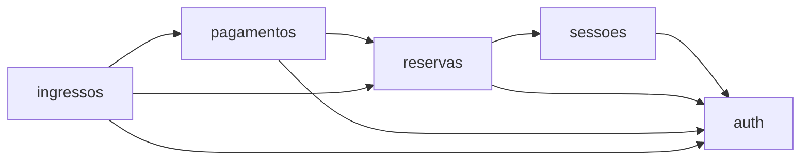
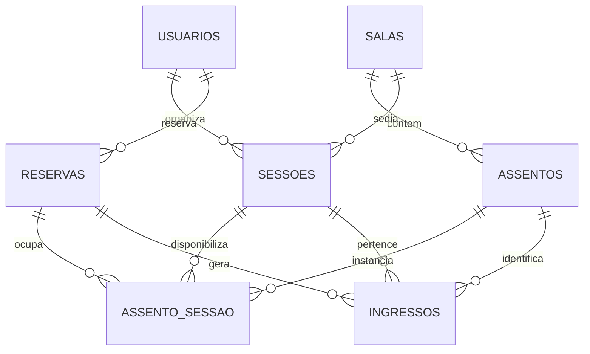
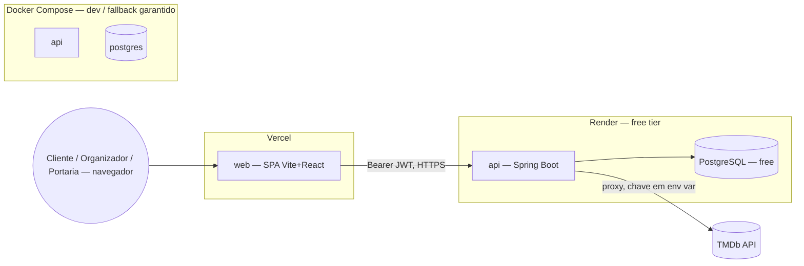

# Architecture Spine — rolo35

## Design Paradigm

**Layered architecture, empacotada por domínio primeiro, camada depois.** Cada domínio (`auth`, `sessoes`, `reservas`, `pagamentos`, `ingressos`) é um pacote Java auto-contido com suas próprias sub-camadas `controller → service → repository` — não existe um pacote `controller`/`service`/`repository` único guardando classes de todos os domínios. Regra de negócio nunca vive no controller (non-negotiable herdado das instruções do projeto, `[ADOPTED]`).

A direção de dependência entre pacotes de domínio é parte do paradigma, não um detalhe. **Convenção da seta: `A --> B` significa "A depende de B" (aponta pra dependência).**



No front, o paradigma espelha o back: a SPA nunca fala com a API fora de uma camada `api/` dedicada — ver AD-2.

## Invariants & Rules

### AD-1 — Empacotamento por domínio com direção de dependência fixa

- **Binds:** todo o back-end (`br.com.rolo35.*`)
- **Prevents:** um pacote de domínio construído independentemente importar de volta de outro que já depende dele (ciclo), e regra de negócio vazando pro controller
- **Rule:** pacotes organizados por domínio (`auth`, `sessoes`, `reservas`, `pagamentos`, `ingressos`), cada um com `controller/service/repository` próprios. Dependência só na direção `{pagamentos, ingressos} → reservas → sessoes → auth` (diagrama acima; `A → B` = "A depende de B") — nunca o inverso; `auth` não depende de nenhum outro domínio, `pagamentos` depende de `reservas` (precisa ler/travar `Reserva` — AD-6), `ingressos` depende de `reservas` e `pagamentos`. `[ADOPTED]` (camadas) + confirmado pelo usuário (direção de dependência).

### AD-2 — Camada `api/` dedicada no front-end

- **Binds:** `web/src/api/*`, todo componente que consome dado do back-end
- **Prevents:** `fetch` espalhado por componente com tipagem ad-hoc divergente, tratamento de erro/JWT duplicado por tela
- **Rule:** um módulo por domínio (`api/sessoes.ts`, `api/reservas.ts`, `api/pagamentos.ts`, `api/ingressos.ts`, `api/auth.ts`) exporta funções tipadas encapsulando o `fetch`; componente nunca chama `fetch` direto. Anexa `Authorization` condicionalmente e parseia o envelope de erro (AD-11) num único lugar. `client.ts` configura o timeout do `fetch` com folga suficiente pra tolerar o cold start documentado do Render (~1min) — evita confundir wake-up lento com erro de rede.

### AD-3 — Lock de assento via linha pré-criada + pessimistic lock

- **Binds:** FR-9, FR-10, FR-11, FR-6
- **Prevents:** dupla-venda de assento sob concorrência resolvida só por checagem de aplicação (proibido pela FR-11); estado de assento lido de forma inconsistente entre telas
- **Rule:** ao criar uma sessão, popula-se `assento_sessao` com uma linha por assento da sala (`status=LIVRE`), na mesma transação do insert da sessão. Reservar N assentos adquire `SELECT ... FOR UPDATE` nas N linhas, **ordenadas por `assento_id`** (evita deadlock entre reservas concorrentes), dentro de uma única transação — se qualquer assento não está disponível, a transação inteira sofre rollback (sem hold parcial). Constraint `UNIQUE (sessao_id, assento_id)` mantida como backstop estrutural, não como mecanismo primário. **FR-6 (conflito sala/horário) reaproveita o mesmo primitivo, com sobreposição real, não colisão de timestamp exato:** criar uma sessão adquire `SELECT ... FOR UPDATE` na linha da `sala` (serializa criações concorrentes pra aquela sala), então checa se alguma sessão existente pra essa sala se sobrepõe à janela `[data_hora, data_hora + BUFFER_FIXO)` — `BUFFER_FIXO` (ex.: 4h) cobre a duração de qualquer filme real + troca de sala, sem precisar modelar runtime do TMDb.

### AD-4 — TTL de reserva por status efetivo (lazy), sem job agendado

- **Binds:** `assento_sessao`, mapa de assentos (FR-9), tentativa de reserva (FR-10), confirmação de pagamento (FR-12)
- **Prevents:** assento preso como ocupado após o TTL vencer só porque nenhum processo de fundo rodou; trabalho de scheduler que não teria efeito observável dado o deploy
- **Rule:** nenhum processo de fundo expira reservas. Todo lugar que **lê ou escreve** o estado de um assento calcula o **status efetivo** a partir de `expires_at` — `RESERVADO` com `expires_at < now()` é tratado como livre, nunca confiando no valor bruto da coluna `status`. Motivo: Render free dorme após 15min (job não rodaria durante o sono) e V1 não tem WebSocket/sync ao vivo (outro cliente só vê estado atualizado ao consultar, que já dispara o lazy check).

### AD-5 — Transação de lock curta, com timeout próprio

- **Binds:** toda transação que adquire `SELECT ... FOR UPDATE` (assento_sessao, reservas, ingressos)
- **Prevents:** lock preso por chamada externa lenta esgotando o pool de conexão sob concorrência (crítico no Render free, pool pequeno)
- **Rule:** transação que segura um lock pessimista faz só checagem/reivindicação de estado — nenhuma chamada externa, nenhuma escrita não relacionada dentro dela. `lock_timeout` curto (poucos segundos) configurado nessa transação. `connection-timeout` do HikariCP é config separada, com folga própria — os dois nunca ficam acoplados, e nenhum dos dois é afetado pelo cold start do Render (que acontece antes de qualquer transação começar).

### AD-6 — Confirmação de pagamento idempotente via lock pessimista em `reserva`

- **Binds:** FR-12, FR-13
- **Prevents:** duas confirmações concorrentes emitindo ingressos duplicados; parâmetros de teste conflitantes (uma aprovação, uma recusa) produzindo estado inconsistente entre o que foi persistido e o que cada chamador recebeu
- **Rule:** confirmação adquire `SELECT ... FOR UPDATE` na linha da `reserva` (mesmo padrão de AD-3/AD-5). `reserva` tem só 3 estados **gravados**: `ATIVA` (default), `CONFIRMADA`, `RECUSADA` — "expirada" **não é estado persistido**, é calculado (`ATIVA` + `expires_at < now()` no momento da confirmação), mesma lógica de AD-4. Se o status já não é `ATIVA`-não-vencida ao adquirir o lock, a chamada não reprocessa o parâmetro recebido — devolve o que já está persistido. **Write path, na mesma transação:** aprovado transiciona `reserva → CONFIRMADA` e `assento_sessao.status` das linhas dessa reserva `RESERVADO → VENDIDO`; recusado transiciona `reserva → RECUSADA` e `assento_sessao.status` `RESERVADO → LIVRE` (limpa `reserva_id`/`expires_at`) **imediatamente** — satisfaz FR-12 ("libera imediatamente"), não espera o lazy check de AD-4 nesse caminho. **Resposta:** toda chamada (vencedora ou não) recebe `200` com `{status: CONFIRMADA|RECUSADA, ingressos: [...] | null}` refletindo o estado persistido — nunca um código de erro, já que ambos os desfechos são resultados válidos de uma tentativa de pagamento. Isso garante que nunca existe um estado em que ingresso foi emitido **e** assento foi liberado pra mesma reserva.

### AD-7 — Parâmetro de teste do pagamento simulado no corpo da requisição

- **Binds:** FR-12 (endpoint de confirmação de pagamento)
- **Prevents:** parâmetro de decisão de negócio (aprovar/recusar) tratado como filtro (query param) ou metadado (header), inconsistente com o resto dos DTOs do domínio
- **Rule:** `POST` de confirmação de pagamento recebe `{"resultadoSimulado": "APROVADO" | "RECUSADO"}` no corpo, validado por Bean Validation como qualquer outro DTO do domínio.

### AD-8 — Código de ingresso assinado por HMAC-SHA256

- **Binds:** FR-14, FR-16, FR-19
- **Prevents:** código de ingresso forjável/adivinhável por incremento; QR denso demais pra leitura confiável numa fila real; dado mutável (status "utilizado") duplicado/dessincronizado como claim de token
- **Rule:** `codigo = uuid + "." + base64url(HMAC-SHA256(secret, uuid))`, onde `uuid` é a própria PK da linha `ingressos` — sem coluna própria de código, computado on-the-fly em geração e validação. Validação recomputa o HMAC sobre o `uuid` extraído e compara em tempo constante **antes** de tocar o banco — assinatura inválida retorna "inválido" sem consulta. Só após validar a assinatura o `sessao_id` (herdado da linha `ingressos`) é comparado com a sessão selecionada pela portaria (FR-17) pra decidir "evento errado" — é igualdade de ID, não expiração temporal.

### AD-9 — Separação de rota entre leitura pública e validação de portaria

- **Binds:** FR-16, FR-19, FR-20
- **Prevents:** link de compartilhamento público sendo usado como bypass da validação de portaria (non-negotiable explícito das instruções do projeto)
- **Rule:** `GET /ingressos/{codigo}` é pública, somente leitura, nunca muda estado, sem lock. `POST /portaria/validacoes` exige papel `PORTARIA` + sessão selecionada, muta estado (`VALIDO → UTILIZADO`) com o mesmo lock pessimista de linha de AD-3/AD-5/AD-6 aplicado à tabela `ingressos`. Nenhuma outra rota transiciona esse estado.

### AD-10 — Boundary de autenticação: Bearer JWT, localStorage, CORS allow-list

- **Binds:** toda rota autenticada da API, toda chamada autenticada da camada `api/` do front
- **Prevents:** mistura de modelo de sessão (cookie) com bearer-token; configuração de CORS cross-site desnecessária dado que não há non-negotiable de segurança que exija cookie httpOnly
- **Rule:** token JWT (claim `papel`) transportado via header `Authorization: Bearer <token>`, guardado em `localStorage` no front — não em cookie. CORS no back com allow-list explícita de origens (dev local + URL de produção da Vercel), sem `credentials`. Toda rota valida papel no back-end, inclusive rotas de portaria — nunca só escondendo botão/rota no front (`[ADOPTED]`).

### AD-11 — Envelope de erro único + `GlobalExceptionHandler`

- **Binds:** toda resposta de erro da API
- **Prevents:** cada tela do front parseando erro num formato próprio; stacktrace ou mensagem de infraestrutura (Postgres/Hibernate) vazando na resposta
- **Rule:** toda exceção de negócio é mapeada por um `GlobalExceptionHandler` (`@RestControllerAdvice`) pra `{"codigo": "<ENUM_ESTAVEL>", "mensagem": "<texto>"}` com o status HTTP apropriado. Handler de fallback genérico cobre qualquer exceção não mapeada (`500`, `codigo=ERRO_INTERNO`, mensagem fixa) — nunca expõe detalhe interno. Códigos usados nesta spine (lista não exaustiva, cada story pode adicionar o seu): `ASSENTO_INDISPONIVEL`, `RESERVA_EXPIRADA`, `RESERVA_NAO_ATIVA`, `SESSAO_CONFLITANTE`, `EVENTO_ERRADO`, `NAO_AUTORIZADO`, `ERRO_INTERNO`.

### AD-12 — DTO explícito por endpoint `[ADOPTED]`

- **Binds:** toda resposta da API
- **Prevents:** campo sensível de banco (hash de senha, dado de outro usuário) vazando por serialização direta de entidade JPA
- **Rule:** toda resposta é serializada a partir de um DTO explícito por endpoint, nunca da entidade JPA/registro de banco diretamente. Non-negotiable das instruções do projeto/PRD §5.

### AD-13 — Nomenclatura: entidades em português, código em inglês `[ADOPTED]`

- **Binds:** todo o schema de banco e todo o código
- **Prevents:** mistura de idioma dentro do mesmo domínio (ex. tabela `sessions` ao lado de `assentos`)
- **Rule:** entidades/tabelas em português (`sessoes`, `salas`, `assentos`, `ingressos`, `reservas`, `assento_sessao`, `usuarios`); classes de serviço, métodos e variáveis em inglês. Non-negotiable das instruções do projeto.

### AD-14 — Sem tabela `filmes` própria

- **Binds:** `sessoes`, proxy TMDb (FR-4)
- **Prevents:** tabela/join relacional criado sem nenhuma feature que o exija
- **Rule:** `sessoes` grava um snapshot direto dos campos do TMDb usados pela tela (`tmdb_id`, `titulo`, `poster_url`, `sinopse`, `data_estreia`) no momento da criação. Não existe tabela `filmes` própria — nenhuma FR do V1 precisa de catálogo relacional local.

## Consistency Conventions

| Concern | Convention |
| --- | --- |
| Naming (entidades, pacotes, código) | Entidades/tabelas em português; código em inglês; pacotes por domínio (AD-1, AD-13) |
| Mutação de estado sob concorrência | Lock pessimista de linha (`SELECT ... FOR UPDATE`), transação curta, `lock_timeout` próprio — mesmo padrão em `assento_sessao`, `reservas`, `ingressos` (AD-3, AD-5, AD-6, AD-9) |
| Serialização de resposta | DTO explícito por endpoint, nunca entidade JPA direta (AD-12) |
| Formato de dado (JSON, datas) | JSON da API em camelCase (default do Jackson); banco em snake_case (AD-13) — conversão é responsabilidade do Jackson, nunca manual. Datas/horas em ISO-8601 UTC. |
| Envelope de erro | `{codigo, mensagem}` via `GlobalExceptionHandler` (AD-11) |
| Autorização por posse de recurso (FR-2) | Acessar/editar recurso de outro dono retorna `403` (não `404`) — confirma que o recurso existe mas nega acesso, consistente com FR-2 |
| Autenticação | Bearer JWT em header `Authorization`, claim `papel`, `localStorage` no front, CORS allow-list (AD-10) |
| Segredos | Chave TMDb, `JWT_SECRET`, `TICKET_HMAC_SECRET` (AD-8, distinto do `JWT_SECRET` — nunca reaproveitado) e credenciais de banco só em variável de ambiente — nunca commitados, nunca no bundle do client `[ADOPTED]` |
| Front → back-end | Só via camada `api/` dedicada, um módulo por domínio (AD-2) |

## Stack

*Verificado na web em 2026-08-10 — ver fontes no memlog desta run.*

| Name | Version |
| --- | --- |
| Java | 21 |
| Spring Boot | 4.1.0 (GA jun/2026) |
| Spring Data JPA / Spring Security / Flyway | via `spring-boot-starter-*` (pom.xml) |
| PostgreSQL | 16 |
| Vite | 8.x (8.0.9, abr/2026) |
| React | 19.2.8 (jul/2026) |
| TypeScript | 6.x (TS 7.0/Go-native GA'd 5 dias antes desta verificação — cedo demais pra apostar sob prazo de 5 dias; 6.x é a major estável anterior) |
| Tailwind CSS | 4.x |
| JUnit 5 / Mockito / Testcontainers | via `spring-boot-testcontainers`, `testcontainers-postgresql` (pom.xml) |

## Structural Seed

```text
api/src/main/resources/db/migration/
  V1__schema.sql       # schema completo (7 entidades)
  V2__seed.sql         # seed versionado: 1 organizador, 2 clientes, 1 portaria, 1 sessão publicada com assentos livres

api/src/main/java/br/com/rolo35/
  auth/
    controller/        # AuthController
    service/           # AuthService, JwtService
    repository/         # UsuarioRepository
    Usuario.java
  sessoes/
    controller/        # SessaoController
    service/           # SessaoService
    repository/         # SessaoRepository, SalaRepository, AssentoRepository
    catalogo/          # TmdbClient — proxy exclusivo TMDb (FR-4)
    Sessao.java, Sala.java, Assento.java
  reservas/
    controller/        # ReservaController
    service/           # ReservaService — lock de assento (AD-3)
    repository/         # ReservaRepository, AssentoSessaoRepository
    Reserva.java, AssentoSessao.java
  pagamentos/
    controller/        # PagamentoController
    service/           # PagamentoService — sem entidade própria, opera sobre Reserva (AD-6)
  ingressos/
    controller/        # IngressoController (público), PortariaController (validação)
    service/           # IngressoService, CodigoIngressoService (HMAC, AD-8)
    repository/         # IngressoRepository
    Ingresso.java
  common/
    GlobalExceptionHandler.java   # AD-11
    ApiError.java

web/src/
  api/                 # AD-2 — client HTTP tipado por domínio
    client.ts          # fetch wrapper, header JWT, parse do envelope de erro
    auth.ts, sessoes.ts, reservas.ts, pagamentos.ts, ingressos.ts
  pages/ (ou routes/)
  components/
    SeatMap/
```

### Entidades (ERD)



`usuarios(id, nome, email, senha_hash, papel, created_at)` — uma tabela pros três papéis (`papel` discrimina; nenhum papel tem campo próprio que justifique split). `salas(id, nome, linhas, colunas)`. `assentos(id, sala_id, fileira, numero)`. `sessoes(id, organizador_id, sala_id, tmdb_id, titulo, poster_url, sinopse, data_estreia, data_hora, preco, created_at)`. `assento_sessao(sessao_id, assento_id, status, reserva_id, expires_at)` — PK composta, populada na criação da sessão (AD-3). `reservas(id, cliente_id, sessao_id, status, created_at, expires_at)`. `ingressos(id uuid, reserva_id, assento_id, sessao_id, status, validated_at, created_at)` — `id` é a própria chave usada no código público (AD-8), sem coluna de código separada.

### Deployment & Environments



Render free dorme após 15min sem tráfego (~1min pra acordar no próximo request); Postgres free expira após prazo a confirmar no dashboard — ambos documentados no README, não escondidos. Docker Compose local (Postgres + API) é o caminho alternativo garantido; front roda separado via `npm run dev` (deploy dele é Vercel, não entra no compose).

## Capability → Architecture Map

| Capability / Área (PRD) | Lives in | Governed by |
| --- | --- | --- |
| §4.1 Autenticação e Papéis (FR-1–3) | `auth/` | AD-1, AD-10, AD-13 |
| §4.2 Catálogo de Filmes (FR-4) | `sessoes/catalogo/` | AD-14, non-negotiable TMDb backend-only |
| §4.3 Gestão de Sessões (FR-5–7) | `sessoes/` | AD-1, AD-3 (FR-6), AD-14 |
| §4.4 Busca e Reserva de Assento (FR-8–11) | `sessoes/` (busca), `reservas/` (lock) | AD-3, AD-4, AD-5 |
| §4.5 Pagamento Simulado (FR-12–13) | `pagamentos/` | AD-6, AD-7 |
| §4.6 Emissão e Consulta de Ingresso (FR-14–15) | `ingressos/` | AD-8, AD-12 |
| §4.7 Compartilhamento Público (FR-16) | `ingressos/` | AD-8, AD-9 |
| §4.8 Validação na Portaria (FR-17–20) | `ingressos/` | AD-8, AD-9, AD-5 |

## Deferred

- **FR-6, buffer fixo em vez de runtime real do filme.** A janela de conflito de sala (AD-3) usa um buffer fixo (ex. 4h) em vez da duração real do filme (disponível no TMDb, mas não capturada no snapshot de `sessoes` — AD-14). Simplificação deliberada: cobre o caso real (nenhum filme dura 4h) sem precisar modelar runtime. Revisitar só se sessões precisarem de buffers mais justos.
- **Re-scaffold de `web/` (Next.js → Vite).** A decisão de stack (Vite+React SPA, AD-2) já está fixada; a execução do re-scaffold é tarefa de implementação da primeira story (fatia vertical), não pendência de arquitetura.
- **Logging/observabilidade.** Sem convenção própria fixada nesta run — usar defaults do Spring Boot (SLF4J/Logback). Revisitar só se surgir necessidade concreta (ex. depurar concorrência em produção).
- **Rate limiting em endpoints públicos** (busca de sessões, link de ingresso, mapa de assentos). Não é non-negotiable do PRD; fica de fora do V1 por decisão deliberada dado o prazo de 7 dias. **Emenda parcial (Story 1.3)**: as três rotas citadas aqui são de leitura, e continuam sem teto. `POST /api/auth/cadastro`, criada depois desta decisão, é a única rota pública que escreve — e escreve conta com o papel que o corpo pedir — então ganhou teto por endereço de origem. Ver `docs/decisions.md`.
